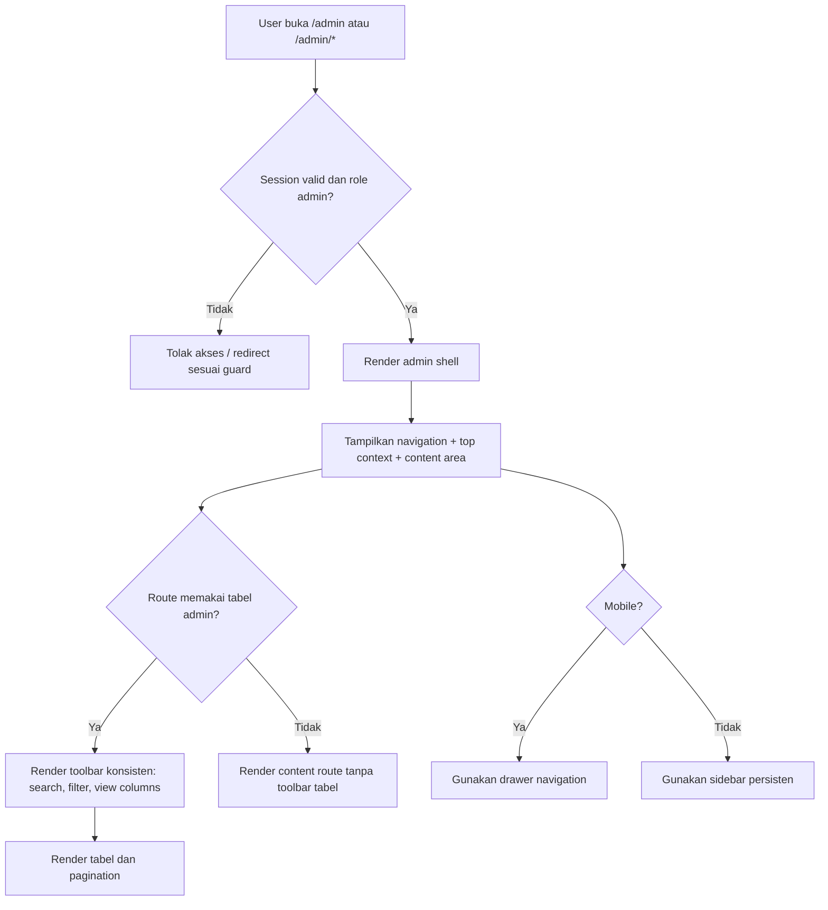

# Admin Shell Flow
## Tujuan
Dokumen ini merangkum user-flow dan kontrak UI/UX untuk admin shell pada Phase `P3`. Dokumen ini mengikuti `.docs/PRD.md`, terutama bagian `5.2`, `7`, `7.1`, dan `10`, serta backlog dan acceptance criteria Phase `P3` di `.docs/E2E-FIRST-PHASE-PLAN.md`.

Dokumen ini mengunci shell admin sebagai area kerja operasional yang aman, elegan, dan reusable untuk route admin v1. Shell admin bukan sekadar layout pembungkus. Shell ini harus memberi orientasi yang konsisten, menjaga boundary server-side admin, dan menjadi fondasi untuk pola tabel admin di phase berikutnya.

## Scope
- route shell `/admin/*` untuk user role `admin`
- guard akses admin dan forbidden state
- struktur layout global admin: navigation, top context, content area
- pola `Admin Identity` di header dan sidebar
- shared admin table pattern tingkat shell: `search`, `filter`, `view columns`, `pagination`
- kontrak visual dan responsive behavior desktop, tablet, mobile
- light mode dan dark mode yang sama-sama polished

## Prinsip Wajib
- semua route `/admin/*` hanya bisa diakses oleh role `admin`
- semua query dan mutation admin wajib dijalankan server-side dengan session user admin biasa
- browser admin tidak boleh memakai credential database istimewa atau service credential langsung
- shell admin harus terasa premium-operational: elegan, rapi, cepat dipindai, tetapi tidak dekoratif berlebihan
- layout admin wajib responsif antar device tanpa mengorbankan hierarchy, keterbacaan, atau action priority
- light mode dan dark mode sama-sama first-class, bukan salah satunya sekadar fallback
- semua halaman admin yang menampilkan tabel wajib mewarisi kontrak global admin table: `search`, `filter`, `view columns`, dan `pagination`
- jika sebuah tabel admin menampilkan user, format tampilannya wajib `avatar + username + email`
- jika `avatar_url` tidak tersedia, shell wajib mendukung fallback avatar berupa inisial username dengan warna background yang konsisten per user, bukan berubah-ubah tiap render
- `Admin Identity` wajib tampil di header kanan atas dan juga di area bawah sidebar kiri pada desktop
- `Admin Identity` berisi `avatar + username + email`
- klik `Admin Identity` wajib membuka dropdown menu minimal berisi `Account` dan `Logout`

## Inventaris Screen dan State
- `/admin/*` state shell loading
- `/admin/*` state authorized dan route siap render
- `/admin/*` state forbidden untuk non-admin atau session tidak valid
- `/admin/*` state route error
- desktop navigation state
- mobile navigation drawer closed
- mobile navigation drawer open
- admin identity dropdown closed
- admin identity dropdown open
- table toolbar state default
- table toolbar state search aktif
- table toolbar state filter aktif
- table toolbar state custom column visibility aktif

## Peta Flow Ringkas


## 1. Tujuan Shell Admin
Shell admin harus membuat admin merasa sedang bekerja di workspace operasional yang terstruktur, bukan berpindah-pindah halaman CRUD yang terpisah. Karena Phase `P3` menjadi fondasi untuk seluruh area admin, shell ini harus reusable dan cukup netral untuk menampung phase berikutnya tanpa kehilangan kualitas visual.

### Pertanyaan UX yang harus dijawab shell
- saya sedang berada di area admin mana
- action utama apa yang tersedia pada halaman ini
- bagaimana saya berpindah ke area admin lain tanpa kehilangan orientasi
- apakah state halaman saat ini normal, loading, error, atau forbidden

## 2. Struktur Layout dan Hierarchy
Shell admin harus menjaga hierarchy yang stabil di semua route admin.

### Hierarchy utama
1. navigation sebagai anchor orientasi
2. page context area untuk title, subtitle, atau summary singkat
3. toolbar route-level untuk action utama atau kontrol tabel
4. content area utama untuk tabel, form, card, atau empty state

### Layout desktop
- gunakan sidebar kiri persisten untuk navigasi utama admin
- content area berada di kanan dengan lebar yang nyaman untuk data-dense UI
- top context area tampil di atas content sebagai tempat judul halaman, deskripsi singkat, aksi global ringan bila memang ada, dan `Admin Identity` di kanan atas
- sidebar harus cukup tenang secara visual agar tidak melawan area data, tetapi nav aktif tetap sangat jelas
- area bawah sidebar menampilkan `Admin Identity` yang sama sebagai anchor akun yang selalu mudah ditemukan

### Layout tablet
- sidebar dapat dipertahankan dalam bentuk yang lebih ringkas jika ruang cukup, atau berubah menjadi drawer jika lebar mulai sempit
- top context area dan toolbar boleh wrap menjadi dua baris selama urutan prioritas tetap jelas
- komponen tabel tetap menjadi pusat halaman, bukan dipaksa ke layout card yang menghilangkan scanability tanpa alasan
- jika sidebar dipadatkan atau berubah menjadi drawer, `Admin Identity` tetap harus tersedia jelas di header kanan atas

### Layout mobile
- navigation utama berubah menjadi drawer atau sheet, bukan sidebar persisten
- top context area tetap menjadi anchor orientasi halaman
- title, subtitle, CTA, dan kontrol toolbar perlu dipadatkan secara terstruktur, bukan sekadar diperkecil
- prioritas visual di mobile: judul halaman, action utama, search, lalu kontrol sekunder seperti filter dan view columns
- `Admin Identity` tetap berada di header kanan atas sebagai titik masuk dropdown `Account` dan `Logout`

## 2A. Wireframe Teks Shell Admin
Bagian ini memberi gambaran bentuk layout tanpa mengunci implementasi visual terlalu detail. Tujuannya agar hierarchy dan responsive behavior lebih mudah dibayangkan sebelum implementasi.

### Desktop shell
```text
+-----------------------------------------------------------------------------------+
| Sidebar Admin        | Top Context Area                                           |
|----------------------|------------------------------------------------------------|
| Logo / Brand         | Page Title              [Admin Identity: avatar user mail] |
| Dashboard            | Page Subtitle / Summary                                  ... |
| Package   [active]   +------------------------------------------------------------+
| Assets               | Route Toolbar / CTA Area                                   |
| Subscriber           +------------------------------------------------------------+
| Users                |                                                            |
| CD-Key               | Main Content Surface                                       |
| Logs                 | - table / cards / forms                                    |
|                      | - empty / loading / error state                            |
|----------------------|                                                            |
| Admin Identity       |                                                            |
| avatar + username    |                                                            |
| email                |                                                            |
+-----------------------------------------------------------------------------------+
```

### Tablet shell
```text
+------------------------------------------------------------------------------+
| Compact Sidebar or Drawer Trigger | Page Title     [Admin Identity/Menu]    |
+------------------------------------------------------------------------------+
| Subtitle / Summary                                                        ... |
+------------------------------------------------------------------------------+
| Route Toolbar: Search | Filter | View Columns | CTA                           |
+------------------------------------------------------------------------------+
| Main Content Surface                                                       |
| - tabel tetap jadi fokus                                                   |
| - toolbar boleh wrap 2 baris                                               |
+------------------------------------------------------------------------------+
```

### Mobile shell
```text
+------------------------------------------------------+
| [Menu]  Page Title            [Admin Identity/Menu]  |
+------------------------------------------------------+
| Subtitle singkat / summary                           |
+------------------------------------------------------+
| Primary CTA                                           |
+------------------------------------------------------+
| Search                                                |
+------------------------------------------------------+
| Filter / View Columns                                 |
+------------------------------------------------------+
| Main Content                                          |
| - tabel dengan horizontal scroll terkontrol           |
| - atau state loading / empty / error                  |
+------------------------------------------------------+
```

### Mobile drawer state
```text
+--------------------+---------------------------------+
| Drawer Navigation  | Current Page Context            |
|--------------------|---------------------------------|
| Dashboard          | Content tertutup sebagian       |
| Package [active]   | di belakang overlay             |
| Assets             |                                 |
| Subscriber         |                                 |
| Users              |                                 |
| CD-Key             |                                 |
+--------------------+---------------------------------+
```

### Dropdown wireframe
```text
+------------------------------------------------------+
| Admin Identity: avatar + username + email           |
+------------------------------------------------------+
| Account                                              |
| Logout                                               |
+------------------------------------------------------+
```

## 3. Pola Navigation Admin
Navigation admin harus konsisten, mudah dipindai, dan tidak membuat user merasa ada terlalu banyak level hierarki palsu.

### Aturan navigation
- nav item aktif harus punya pembeda visual yang kuat di light mode dan dark mode
- icon boleh dipakai untuk membantu scanning, tetapi label teks tetap menjadi elemen utama
- route yang belum usable penuh pada phase berjalan tidak boleh terlihat seperti fitur matang jika belum siap dibuka untuk kerja normal
- mobile drawer wajib punya affordance close yang jelas dan tidak menutupi konteks halaman terlalu lama

### Nav UX yang disarankan
- gunakan grouping ringan bila jumlah item bertambah di phase berikutnya
- hindari nav yang terlalu dekoratif, glowing, atau ramai badge karena itu menurunkan trust operasional
- saat user berpindah route admin, shell harus menjaga continuity visual sehingga admin tidak merasa pindah aplikasi

## 3A. Kontrak `Admin Identity`
`Admin Identity` adalah affordance akun admin yang selalu konsisten di seluruh area shell.

### Komposisi
- avatar
- username
- email

### Penempatan
- header kanan atas
- sidebar kiri bawah pada desktop

### Perilaku
- klik pada `Admin Identity` membuka dropdown
- dropdown minimum berisi `Account` dan `Logout`
- dropdown harus terasa ringan dan cepat, bukan modal atau full-page flow
- `Logout` harus jelas sebagai aksi keluar, tetapi tidak perlu bergaya destruktif berlebihan

### Responsive notes
- di mobile dan tablet tanpa sidebar persisten, `Admin Identity` tetap tersedia di header kanan atas
- jika drawer dibuka di mobile, item akun tambahan boleh juga muncul di drawer, tetapi titik interaksi utama tetap di header

## 4. Kontrak Global Admin Table Pattern
Pola tabel admin adalah kontrak global, bukan enhancement opsional per route.

### Kontrol minimum yang wajib ada
- `search`
- `filter`
- `view columns`
- `pagination`

### Urutan visual yang disarankan
- sisi kiri toolbar: search utama
- sisi kanan toolbar: filter dan `view columns`
- CTA route-level seperti `Add New` boleh berada di area yang sama atau pada header halaman, tetapi tidak boleh bersaing dengan search sebagai kontrol orientasi data
- pagination tampil setelah tabel dan tetap mudah ditemukan

### Prinsip UX table toolbar
- search adalah affordance tercepat untuk narrowing data, jadi posisinya harus paling mudah ditemukan
- filter cocok untuk narrowing berbasis kategori atau status, bukan menggantikan search text
- `view columns` harus diposisikan sebagai personalisasi tampilan, bukan filter data
- toolbar harus tetap usable di mobile: wrapping diperbolehkan, tetapi urutan prioritas tidak boleh rusak

### Wireframe teks toolbar tabel admin
```text
+----------------------------------------------------------------------------------+
| Search................................ | Filter | View Columns | Secondary | CTA |
+----------------------------------------------------------------------------------+
| Table Header                                                                   ... |
| Row 1                                                                            |
| Row 2                                                                            |
| Row 3                                                                            |
+----------------------------------------------------------------------------------+
| Pagination: < Prev   1  2  3   Next >                                            |
+----------------------------------------------------------------------------------+
```

## 5. Pola User Cell Global
Jika sebuah tabel admin menampilkan user, shell wajib menjaga kontrak user cell yang konsisten.

### Komposisi user cell
- avatar di kiri
- username sebagai teks utama
- email sebagai teks sekunder

### Aturan fallback avatar
- jika `avatar_url` kosong, tampilkan inisial username
- warna background avatar fallback harus konsisten per user
- konsisten berarti user yang sama mendapat warna yang sama di semua tabel dan semua render yang relevan

### Prinsip UX
- username harus lebih dominan dari email
- email tetap mudah dibaca untuk kebutuhan operasional admin
- avatar fallback tidak boleh terlalu dekoratif sampai mengganggu scanability tabel

## 6. Visual Direction Shell Admin
Shell admin harus memenuhi permintaan produk: dashboard admin yang elegan, cantik, dan responsive antar device, tetapi tetap cocok untuk pekerjaan operasional.

### Karakter visual yang dikunci
- modern dan premium, dengan spacing yang rapi dan hierarchy yang jelas
- utilitarian yang refined, bukan dashboard generik yang terlalu dingin atau terlalu ornamental
- data-dense tetapi tetap breathable melalui whitespace yang cukup pada header, toolbar, dan surface utama

### Elemen visual yang disarankan
- background netral dan surface card yang bersih
- aksen warna primer yang tegas untuk focus, active state, dan interactive emphasis
- badge status yang jelas tetapi tidak mencolok berlebihan
- shadow dan border halus untuk memisahkan area kerja tanpa memberi kesan berat
- micro-interactions singkat pada hover, focus, open drawer, open popover, dan active nav

### Anti-pattern yang harus dihindari
- sidebar dengan terlalu banyak efek glow, gradient, atau noise visual
- tabel yang terasa sempit karena padding terlalu kecil atau typography terlalu padat
- mobile layout yang memindahkan terlalu banyak kontrol penting ke area tersembunyi tanpa hierarchy yang jelas
- dark mode yang terlihat mewah tetapi kehilangan contrast dan readability

## 7. Responsive Behavior
Responsive pada admin shell berarti menjaga kualitas kerja lintas device, bukan sekadar membuat layout muat.

### Kontrak responsive
- desktop memprioritaskan scanability dan density data
- tablet memprioritaskan fleksibilitas layout tanpa kehilangan struktur toolbar tabel
- mobile memprioritaskan action utama dan readability, sambil tetap mempertahankan akses ke kontrol sekunder
- tabel boleh memakai horizontal scroll terkontrol pada viewport sempit, tetapi tidak boleh sampai mematahkan hierarchy halaman

### Breakpoint UX yang disarankan
- small mobile: fokus ke title, CTA, search, lalu kontrol sekunder via wrap atau popover
- tablet: toolbar boleh dua baris, tabel tetap tampil sebagai tabel
- desktop: sidebar persisten, toolbar cenderung satu baris jika memungkinkan

## 8. Light Mode dan Dark Mode
Kedua mode harus sama-sama terlihat intentional.

### Light mode
- surface utama terasa bersih dan profesional
- border, row hover, dan nav active tetap cukup kontras
- status semantic tidak boleh bergantung hanya pada saturation warna

### Dark mode
- gunakan surface gelap yang tetap readable, bukan sekadar hitam penuh di semua layer
- row, border, focus ring, dan badge harus tetap mudah dibedakan
- dark mode harus mempertahankan rasa premium dan calm, bukan neon-heavy dashboard

## 9. State Global Shell
Shell harus punya state yang dapat dipahami tanpa ambiguity.

### `authorized + loading`
- tampilkan skeleton atau placeholder layout yang stabil
- jangan menampilkan layout kosong yang terlihat seperti error

### `authorized + ready`
- navigation, page context, dan content tampil penuh
- route-level state diatur oleh halaman masing-masing

### `forbidden`
- tampilkan state yang jelas bahwa user tidak punya akses admin
- copy harus membedakan forbidden dari error teknis

### `route error`
- tampilkan state error yang jelas di content area tanpa merusak struktur shell secara total
- admin tetap harus tahu berada di area mana dan bisa kembali bernavigasi

## 10. Copy UX yang Disarankan
Shell admin sebaiknya memakai copy yang ringkas, profesional, dan tidak terlalu marketing-heavy.

### Contoh arah copy
- title area: `Admin Dashboard`, `Package Management`, `Assets Management`
- forbidden: `You do not have access to this admin area.`
- generic route error: `This admin page could not be loaded right now.`
- empty navigation context untuk route baru: `This section is not ready yet.`

## 11. Matriks State Shell
| Kondisi                         | Navigation                         | Context Area                 | Content Area                       |
| ------------------------------- | ---------------------------------- | ---------------------------- | ---------------------------------- |
| Admin authorized, route ready   | tampil penuh                       | tampil sesuai route          | tampil sesuai route                |
| Admin authorized, shell loading | placeholder stabil                 | placeholder                  | placeholder                        |
| Admin authorized, route error   | tetap tampil                       | tetap tampil                 | error state route                  |
| Non-admin atau session invalid  | tidak lanjut ke shell kerja normal | tidak lanjut                 | forbidden / redirect state         |
| Mobile nav open                 | drawer tampil                      | context tetap menjadi anchor | content tertutup sebagian oleh nav |

## 12. Batasan yang Harus Dijaga Saat Implementasi
- jangan memindahkan query atau mutation admin ke client side demi kenyamanan UI
- jangan gunakan service credential di browser admin
- jangan membuat setiap halaman admin punya pola toolbar tabel yang berbeda-beda tanpa alasan kuat
- jangan membuat fallback avatar yang berubah warna setiap render untuk user yang sama
- jangan mengorbankan responsive hierarchy demi mempertahankan layout desktop secara paksa di mobile
- jangan menganggap dark mode sebagai mode sekunder yang kurang dipoles
