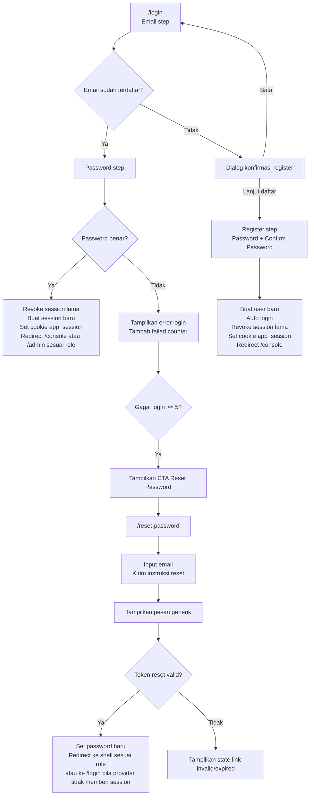

# Auth Flow
## Tujuan
Dokumen ini merangkum flow autentikasi v1 sebagai referensi UI/UX frontend. Semua poin di bawah mengikuti `docs/PRD.md`, terutama bagian `3.1`, `3.2`, `3.3`, `6.1`, dan `6.2`.

## Scope
- halaman `/login` untuk identifikasi email, login, dan register dalam satu flow
- halaman `/reset-password` untuk meminta instruksi reset password dan mengatur password baru
- state default, loading, error, sukses, dan state khusus yang wajib terlihat ke user

## Prinsip Wajib
- autentikasi hanya memakai Email + Password
- semua input password wajib mendukung show/hide
- register wajib punya `password` dan `confirm password`
- password saat register minimal 6 karakter
- login existing user yang berhasil wajib:
  - me-revoke seluruh session lama user
  - membuat session baru
  - menyimpan cookie `app_session`
  - redirect ke `/console` atau `/admin` sesuai role
- public self-register yang berhasil wajib:
  - me-revoke seluruh session lama user
  - membuat session baru
  - menyimpan cookie `app_session`
  - redirect ke `/console`
- satu user hanya boleh punya satu session aktif pada saat yang sama
- jika user login dari browser atau perangkat lain, session lama langsung tidak valid
- tombol `Reset Password` di flow login baru tampil setelah 5 gagal login berturut-turut karena password salah untuk email yang sama
- counter gagal login reset jika login berhasil atau sudah lewat 15 menit sejak kegagalan terakhir
- flow reset password tidak boleh membocorkan apakah email terdaftar atau tidak
- user yang berstatus banned harus ditolak sebelum session app baru dibuat

## Inventaris Screen dan State
- `/login` state email step
- `/login` state password step untuk email yang sudah terdaftar
- `/login` state dialog konfirmasi register untuk email baru
- `/login` state register step dengan password dan konfirmasi password
- `/login` state error login dengan CTA `Reset Password` setelah ambang gagal tercapai
- `/reset-password` state request reset password
- `/reset-password` state instruksi reset berhasil dikirim dengan pesan generik
- `/reset-password` state set password baru setelah token valid dengan `password` + `confirm password`
- `/reset-password` state link invalid atau expired dengan CTA untuk minta link baru

## Peta Flow Ringkas

## 1. Flow Login untuk Email Terdaftar
Login dan register berada dalam satu halaman. Flow login dimulai dari step email, lalu bercabang setelah server mengecek apakah email sudah ada.

| Langkah | Apa yang dilihat user                                        | Apa yang dilakukan user                  | Respons sistem / state berikutnya                                                                                                       |
| ------- | ------------------------------------------------------------ | ---------------------------------------- | --------------------------------------------------------------------------------------------------------------------------------------- |
| 1       | Form dengan field `Email` dan tombol `Next`                  | Input email lalu klik `Next`             | Validasi format email lalu cek ke server melalui trusted auth path apakah email sudah terdaftar                                         |
| 2       | Loading state pada tombol / form                             | Menunggu hasil pengecekan                | Jika email terdaftar, UI berpindah ke password step                                                                                     |
| 3       | Form password untuk email tersebut                           | Input password lalu submit               | Sistem mencoba login user dengan email yang sudah dipilih                                                                               |
| 4A      | Error login jika password salah                              | Coba lagi dengan password yang benar     | Failed counter untuk email itu bertambah hanya jika kegagalannya memang karena password salah                                           |
| 4B      | CTA `Reset Password` mulai terlihat setelah kegagalan ke-5   | Klik `Reset Password` jika lupa password | User masuk ke flow `/reset-password`                                                                                                    |
| 5       | Tidak ada layar sukses yang panjang; flow langsung berlanjut | Login berhasil                           | Sistem revoke session lama, membuat session baru, menyimpan cookie `app_session`, lalu redirect ke `/console` atau `/admin` sesuai role |

### State UI yang wajib ada di login flow
- validasi email yang jelas sebelum request dikirim
- loading state saat cek email dan saat submit password
- error message yang jelas saat password salah
- error message yang jelas saat user banned atau terjadi kegagalan sistem lain yang bukan salah password
- email yang sedang dipakai tetap terlihat saat user sudah masuk ke password step
- aksi untuk kembali atau mengganti email tetap tersedia saat user sudah ada di password step
- CTA `Reset Password` disembunyikan sebelum 5 gagal login berturut-turut untuk email yang sama

### Error message yang disarankan di login flow
- `Email wajib diisi.`
- `Masukkan alamat email yang valid.`
- `Password wajib diisi.`
- `Password yang Anda masukkan salah. Coba lagi.`
- `Lupa password? Reset password untuk lanjut.`
- `Login gagal. Coba beberapa saat lagi.`

## 2. Flow Register untuk Email yang Belum Terdaftar
Register tidak dimulai dari halaman terpisah. User tetap masuk dari `/login`, lalu sistem mengarahkan ke register flow ketika email belum ditemukan.

| Langkah | Apa yang dilihat user                                        | Apa yang dilakukan user                            | Respons sistem / state berikutnya                                                                                                           |
| ------- | ------------------------------------------------------------ | -------------------------------------------------- | ------------------------------------------------------------------------------------------------------------------------------------------- |
| 1       | Form `Email` yang sama seperti flow login                    | Input email baru lalu klik `Next`                  | Sistem mengecek bahwa email belum terdaftar                                                                                                 |
| 2       | Dialog konfirmasi bahwa email belum punya akun               | Memilih lanjut daftar atau batal                   | Jika batal, kembali ke email step. Jika lanjut, UI membuka register step                                                                    |
| 3       | Form register dengan field `Password` dan `Confirm Password` | Isi password, isi konfirmasi password, lalu submit | Sistem memvalidasi panjang minimal 6 karakter dan kecocokan konfirmasi password                                                             |
| 4       | Loading state pembuatan akun                                 | Menunggu proses selesai                            | Sistem membuat user baru                                                                                                                    |
| 5       | Tidak ada login manual kedua                                 | Register berhasil                                  | Sistem langsung auto login, revoke session lama jika ada, membuat session baru, menyimpan cookie `app_session`, lalu redirect ke `/console` |

### State UI yang wajib ada di register flow
- dialog konfirmasi register muncul hanya jika email belum terdaftar
- field `Password` dan `Confirm Password` sama-sama punya show/hide
- error message jelas untuk password kurang dari 6 karakter
- error message jelas untuk password dan konfirmasi password yang tidak sama
- loading state saat pembuatan akun berjalan
- jika user membatalkan dialog konfirmasi, flow kembali bersih ke email step

### Error message yang disarankan di register flow
- `Email wajib diisi.`
- `Masukkan alamat email yang valid.`
- `Password wajib diisi.`
- `Password minimal 6 karakter.`
- `Konfirmasi password wajib diisi.`
- `Konfirmasi password harus sama dengan password.`
- `Akun tidak bisa dibuat sekarang. Coba beberapa saat lagi.`

## 3. Flow Reset Password
Reset password punya halaman sendiri di `/reset-password`. CTA menuju flow ini baru wajib muncul di halaman login setelah 5 gagal login berturut-turut untuk email yang sama, tetapi route ini tetap bisa dipakai sebagai halaman reset password mandiri.

| Langkah | Apa yang dilihat user                                            | Apa yang dilakukan user                  | Respons sistem / state berikutnya                                                                                                                                        |
| ------- | ---------------------------------------------------------------- | ---------------------------------------- | ------------------------------------------------------------------------------------------------------------------------------------------------------------------------ |
| 1       | Halaman `/reset-password` dengan field `Email` dan tombol submit | Input email lalu submit                  | Sistem mengirim instruksi reset password                                                                                                                                 |
| 2       | State sukses dengan pesan generik                                | Membaca instruksi yang ditampilkan       | Jika email tidak ditemukan, UI tetap menampilkan pesan generik yang sama agar keberadaan akun tidak bocor                                                                |
| 3A      | Halaman atau step lanjutan setelah token reset valid             | Membuka link / token reset yang diterima | Sistem memvalidasi token reset                                                                                                                                           |
| 3B      | State link invalid atau expired                                  | Melihat pesan error dan CTA minta ulang  | User dapat meminta link reset baru                                                                                                                                       |
| 4       | Form set password baru dengan `Password` dan `Confirm Password`  | Input password baru lalu submit          | Sistem menyimpan password baru jika token valid                                                                                                                          |
| 5       | Tidak ada layar sukses yang panjang                              | Reset password berhasil                  | Sistem redirect ke `/console` atau `/admin` sesuai role jika provider memberi session valid, atau ke `/login` dengan instruksi jelas jika provider tidak memberi session |

### State UI yang wajib ada di reset password flow
- loading state saat request reset password dikirim
- pesan sukses generik yang tidak membedakan email terdaftar dan tidak terdaftar
- form password baru yang jelas dan fokus ke satu tujuan: mengganti password
- field `Password` dan `Confirm Password` pada step set password baru
- password field pada step set password baru tetap mendukung show/hide
- state link invalid atau expired dengan CTA untuk meminta link baru

### Error message yang disarankan di reset password flow
- `Email wajib diisi.`
- `Masukkan alamat email yang valid.`
- `Permintaan reset password belum berhasil. Coba beberapa saat lagi.`
- `Link reset password tidak valid atau sudah kedaluwarsa. Minta link baru untuk lanjut.`
- `Password baru wajib diisi.`
- `Password baru belum berhasil disimpan. Coba beberapa saat lagi.`

## 4. Dampak Rule Single-Device ke UX
Rule single-device bukan sekadar detail backend. Ini memengaruhi ekspektasi user terhadap sesi login.
- login sukses atau register sukses selalu menggantikan session lama dengan session baru
- browser atau perangkat lama akan kehilangan session aktif setelah user login di tempat lain
- redirect ke route tujuan baru dilakukan setelah session baru benar-benar siap dipakai
- flow auth tidak membutuhkan pilihan `remember multiple devices` karena behavior itu bertentangan dengan PRD

## 5. Catatan UX Copy dan Perilaku
Bagian ini membantu tim frontend menjaga UX tetap konsisten dengan PRD tanpa menambah behavior baru.
- `/login` boleh secara implisit memperlihatkan email terdaftar atau belum terdaftar karena flow memang bercabang setelah cek email
- `/reset-password` tidak boleh memakai copy yang membocorkan apakah email ditemukan atau tidak
- flow sukses login existing sebaiknya terasa cepat karena akhir flow yang benar adalah redirect ke `/console` atau `/admin` sesuai role, bukan berhenti di halaman auth
- flow sukses public register sebaiknya terasa cepat karena akhir flow yang benar adalah redirect ke `/console`
- state error harus muncul dekat field yang bermasalah, bukan hanya sebagai pesan global
- tombol submit perlu disabled saat request sedang berjalan untuk mencegah double submit

## 6. Ringkasan Kebutuhan UI per Route
### `/login`
- email input
- tombol `Next`
- password input dengan show/hide
- confirm password input dengan show/hide untuk register step
- dialog konfirmasi register
- inline validation dan error state
- loading state untuk cek email, login, dan register
- CTA `Reset Password` yang kondisional setelah 5 gagal login berturut-turut

### `/reset-password`
- email input
- tombol submit request reset
- generic success state setelah request dikirim
- form set password baru setelah token valid dengan `password` dan `confirm password`
- invalid/expired token state dengan CTA minta link baru
- password input dengan show/hide
- loading state dan error state yang jelas

## 7. Batasan yang Harus Dijaga Saat Implementasi
- jangan memecah login dan register menjadi dua halaman terpisah jika tetap ingin patuh ke PRD v1
- jangan menampilkan tombol `Reset Password` sejak awal flow login
- jangan menambah metode auth lain seperti OTP, magic link, Google login, atau nomor telepon
- jangan membiarkan lebih dari satu session aktif untuk user yang sama
- jangan membocorkan keberadaan email pada flow reset password
