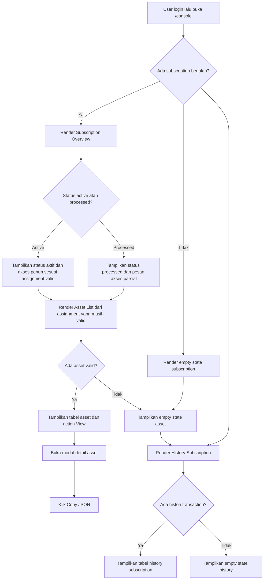

# Console Flow
## Tujuan
Dokumen ini merangkum user-flow dan kontrak UI/UX untuk halaman member `/console` pada Phase `P2`. Dokumen ini mengikuti `.docs/PRD.md`, terutama bagian `3.5`, `3.7`, `3.8`, `3.9`, `6.3`, dan `8`, serta backlog dan acceptance criteria Phase `P2` di `.docs/E2E-FIRST-PHASE-PLAN.md`.

Dokumen ini mengunci `/console` sebagai member console yang fokus pada read path: user harus bisa memahami status subscription, melihat asset aktif yang benar-benar masih valid, dan membaca histori subscription tanpa ambiguity.

## Scope
- halaman `/console` untuk member yang sudah login
- section `Subscription Overview`
- section `Asset List`
- section `History Subscription`
- state UI utama: `active`, `processed`, `expired`, dan tidak ada subscription berjalan
- modal detail asset dengan aksi `Copy JSON`
- layout desktop dan mobile, light mode dan dark mode, serta state loading, empty, dan error yang relevan

## Prinsip Wajib
- `/console` adalah halaman protected untuk role `member` yang punya session valid
- data yang tampil harus berasal dari snapshot console user sendiri, bukan dari query client yang membuka akses data lintas user
- subscription overview minimal menampilkan `status`, `packageName`, `endAt`, dan `daysLeft`
- asset list hanya boleh menampilkan asset yang benar-benar masih boleh diakses user saat ini
- asset tidak boleh tampil jika inventory row sudah `disabled` atau `expired`, walaupun histori assignment masih ada
- histori subscription minimal menampilkan `source`, `package`, `amount (Rp)`, `status`, dan `created_at`
- status `processed` harus dijelaskan dengan jelas bahwa akses user masih parsial, bukan putus total
- jika user tidak punya subscription berjalan, UI harus tetap informatif dan tidak terlihat seperti error sistem
- jika status subscription yang terbaca adalah `canceled`, UI tidak boleh jatuh ke state tak dikenal; state ini harus diperlakukan sebagai non-active state yang terpisah dari `processed`
- Phase `P2` memprioritaskan read path. Slot aksi PRD seperti `Perpanjang Langganan` dan `Redeem Code` boleh disiapkan sebagai ruang UI, tetapi behavior interaktif penuh mengikuti phase berikutnya

## Inventaris Screen dan State
- `/console` state loading awal
- `/console` state sukses dengan subscription `active`
- `/console` state sukses dengan subscription `processed`
- `/console` state sukses dengan subscription `canceled`
- `/console` state sukses tanpa subscription berjalan atau subscription sudah tidak aktif
- `/console` state asset list kosong
- `/console` state history subscription kosong
- `/console` state gagal memuat snapshot console
- modal `View Asset` dengan raw asset dan tombol `Copy JSON`
- feedback copy berhasil atau gagal

## Peta Flow Ringkas

Catatan flow: jika tidak ada subscription berjalan, `Subscription Overview` dapat jatuh ke salah satu non-active state yang eksplisit, yaitu `no subscription`, `expired`, atau `canceled`, tergantung status yang tersedia pada snapshot user.

## 1. Struktur Halaman dan Hierarchy
Halaman `/console` harus terasa seperti dashboard member yang ringkas dan mudah dipindai. Urutan visual wajib mengikuti prioritas informasi user, bukan urutan data backend.

### Hierarchy utama
1. header halaman dengan sapaan singkat dan konteks bahwa ini adalah area langganan aktif user
2. card `Subscription Overview` sebagai area paling dominan di fold pertama
3. section `Asset List` sebagai bukti akses yang benar-benar aktif saat ini
4. section `History Subscription` sebagai catatan histori dengan prioritas visual lebih rendah dari dua section di atas

### Layout desktop
- gunakan container terpusat dengan lebar baca nyaman dan jarak vertikal yang jelas antar section
- `Subscription Overview` tampil sebagai card utama penuh lebar
- `Asset List` dan `History Subscription` tampil sebagai card/table section terpisah di bawahnya
- hindari menaruh tiga section dalam grid tiga kolom karena akan menurunkan fokus user pada status subscription

### Layout mobile
- semua section ditumpuk vertikal dalam satu alur scroll
- card overview tetap muncul paling atas
- tabel dibungkus dengan pola yang tetap usable di mobile: boleh horizontal scroll terkontrol, tetapi header dan action tetap mudah dibaca
- tombol atau action penting minimal punya target sentuh yang nyaman

## 2. Flow Utama `/console`
Flow halaman ini bukan flow input panjang, tetapi flow baca dan verifikasi status. User datang ke `/console` untuk menjawab tiga pertanyaan utama:
- apakah langganan saya masih aktif
- akses asset apa yang benar-benar bisa saya pakai sekarang
- histori subscription saya seperti apa

| Langkah | Apa yang dilihat user            | Apa yang dilakukan user                        | Respons sistem / state berikutnya                                          |
| ------- | -------------------------------- | ---------------------------------------------- | -------------------------------------------------------------------------- |
| 1       | Halaman `/console` setelah login | Menunggu data termuat                          | UI menampilkan skeleton atau loading state yang stabil                     |
| 2       | `Subscription Overview`          | Membaca status utama subscription              | Sistem menampilkan `status`, `packageName`, `endAt`, dan `daysLeft`        |
| 3       | `Asset List`                     | Memeriksa asset yang tersedia                  | UI hanya menampilkan asset aktif yang masih valid di inventory             |
| 4       | Tabel asset dengan action `View` | Klik `View` pada salah satu asset              | Modal detail asset terbuka                                                 |
| 5       | Modal detail asset               | Membaca detail raw asset atau klik `Copy JSON` | Sistem menyalin payload asset ke clipboard dan memberi feedback hasil aksi |
| 6       | `History Subscription`           | Membaca histori transaksi                      | UI menampilkan source, package, amount, status, dan waktu pembuatan        |

### Global loading dan error state
- loading awal harus menjaga layout stabil dengan skeleton pada overview dan placeholder row pada tabel
- jika snapshot console gagal dimuat, tampilkan error state yang jelas di level halaman dengan opsi retry yang mudah ditemukan
- error state halaman tidak boleh terlihat seperti user kehilangan subscription; copy harus membedakan `data gagal dimuat` dari `memang tidak ada data`

## 3. Section `Subscription Overview`
Section ini adalah pusat orientasi halaman. User harus bisa memahami kondisi subscription hanya dalam beberapa detik.

### Informasi minimum
- `status`
- `packageName`
- `endAt`
- `daysLeft`

### Susunan informasi yang disarankan
- baris pertama: badge status dan nama package
- baris kedua: pasangan informasi `Berakhir pada` dan `Sisa hari`
- baris ketiga: pesan status yang menjelaskan kondisi akses user dalam bahasa non-teknis

### State UX yang wajib ada
#### `active`
- badge status tampil paling jelas dan positif
- copy menegaskan bahwa akses aktif tersedia sesuai assignment yang sudah diberikan
- `daysLeft` diperlakukan sebagai data penting, bukan teks pendamping

#### `processed`
- badge status tetap jelas tetapi tidak terasa seperti error fatal
- harus ada pesan bahwa subscription valid, tetapi sebagian akses masih menunggu fulfillment
- user harus memahami bahwa asset yang sudah muncul di `Asset List` tetap boleh dipakai

#### `expired` atau tidak ada subscription berjalan
- overview berubah menjadi empty state informatif, bukan card status normal yang membingungkan
- copy harus menjelaskan bahwa user saat ini belum memiliki subscription aktif
- jangan menampilkan `daysLeft` palsu seperti `0` jika itu membuat status tampak ambigu; lebih baik tampilkan copy yang eksplisit

#### `canceled`
- jika status `canceled` memang tersedia dari snapshot, UI harus menampilkannya sebagai state non-active yang jelas
- treatment visual boleh satu keluarga dengan `expired`, tetapi copy tidak boleh menyamakan penyebabnya
- user harus memahami bahwa akses aktif sudah dicabut karena subscription dibatalkan

### Copy UX yang disarankan
- `active`: `Langganan Anda aktif dan akses yang tersedia bisa langsung digunakan.`
- `processed`: `Langganan Anda sudah berjalan, tetapi sebagian akses masih dalam proses pemenuhan. Asset yang sudah muncul di bawah tetap bisa digunakan.`
- no subscription: `Saat ini belum ada langganan aktif di akun Anda.`
- expired: `Masa langganan Anda sudah berakhir. Akses asset aktif tidak lagi tersedia.`
- canceled: `Langganan Anda sudah dibatalkan. Akses asset aktif tidak lagi tersedia.`

### Catatan aksi pada overview
PRD mendefinisikan aksi `Perpanjang Langganan` dan `Redeem Code` di area overview. `E2E-FIRST-PHASE-PLAN.md` menempatkan perilaku interaktif dua aksi ini pada phase berikutnya, yaitu `P6` untuk extend dan `P7` untuk redeem CD-Key. Untuk menghindari ambiguity antar dokumen, kontraknya dikunci sebagai berikut:
- pada level produk v1, `/console` memang memiliki dua action tersebut
- pada level phase implementasi, action interaktifnya bukan acceptance wajib Phase `P2`
- jika tim ingin menyiapkan ruang UI pada `P2`, area action harus jelas bersifat placeholder non-interaktif atau disembunyikan sampai phase yang relevan
- UI `P2` tidak boleh menampilkan CTA yang terlihat aktif tetapi sebenarnya belum punya flow kerja yang valid

## 4. Section `Asset List`
Section ini menampilkan asset yang benar-benar sudah di-assign ke user dan masih valid untuk diakses saat ini.

### Tujuan UX
- memberi bukti akses yang konkret
- memisahkan akses aktif dari histori assignment lama
- membuat user cepat menemukan asset yang ingin dibuka tanpa harus membaca detail yang tidak perlu lebih dulu

### Kolom minimum
- `id`
- `platform`
- `asset type`
- `note`
- `proxy`
- `expires at`
- `action`

### Aturan tampilan yang wajib dijaga
- hanya asset aktif dan valid yang boleh tampil
- asset disabled atau expired harus langsung hilang dari daftar aktif
- asset yang sudah direvoke atau hilang dari inventory aktif tidak boleh tampil walaupun dulu pernah dipakai user
- action minimum pada setiap row adalah `View`

### Rekomendasi hierarchy kolom
- `platform` dan `asset type` harus mudah discan dari kiri ke kanan
- `note` membantu membedakan asset, jadi tampil sebagai teks sekunder yang tetap terbaca
- `proxy` boleh tampil dengan gaya monospaced atau utilitarian karena sifatnya data teknis
- `expires at` harus mudah dibandingkan antar row
- action `View` ditempatkan konsisten di kolom terakhir

### State UI yang wajib ada di asset list
- loading state berbentuk skeleton tabel atau placeholder row
- empty state saat tidak ada asset valid
- feedback jelas jika modal gagal memuat detail asset
- feedback sukses atau gagal untuk aksi `Copy JSON`

### Empty state yang disarankan
- judul: `Belum ada asset aktif`
- deskripsi untuk user `processed`: `Sebagian akses Anda masih menunggu fulfillment. Asset yang siap dipakai akan muncul di sini.`
- deskripsi untuk user tanpa subscription aktif: `Asset aktif akan muncul di sini saat akun Anda memiliki subscription yang masih berjalan.`

## 5. Flow `View Asset` dan `Copy JSON`
Modal detail asset adalah flow interaktif utama pada Phase `P2`.

| Langkah | Apa yang dilihat user | Apa yang dilakukan user                | Respons sistem / state berikutnya                                        |
| ------- | --------------------- | -------------------------------------- | ------------------------------------------------------------------------ |
| 1       | Tabel `Asset List`    | Klik action `View`                     | Modal terbuka di atas halaman `/console`                                 |
| 2       | Modal detail asset    | Membaca raw asset dan metadata penting | UI menampilkan data mentah dengan format yang mudah disalin dan dipindai |
| 3       | Tombol `Copy JSON`    | Klik tombol copy                       | Sistem menyalin isi asset mentah ke clipboard                            |
| 4A      | Feedback sukses       | Menutup modal atau lanjut memakai data | Toast ringan atau inline feedback menandakan copy berhasil               |
| 4B      | Feedback gagal        | Coba lagi                              | UI menampilkan pesan gagal copy yang jelas                               |

### Kontrak modal detail asset
- modal harus fokus ke satu tugas: melihat detail asset dan menyalin data mentah
- informasi minimum yang tampil: `id`, `platform`, `asset type`, `expires at`, `account` bila ada, `proxy`, `note`, dan raw `asset`
- raw asset sebaiknya ditampilkan dalam blok yang mudah dibaca dengan wrapping atau scroll internal yang terkontrol
- tombol `Copy JSON` adalah primary action dalam modal
- modal wajib punya affordance close yang jelas dan aman untuk keyboard maupun pointer

### Copy UX yang disarankan
- sukses: `JSON asset berhasil disalin.`
- gagal: `JSON asset belum bisa disalin. Coba lagi.`

## 6. Section `History Subscription`
Section ini menjelaskan histori aktivasi subscription user dari seluruh source yang valid di sistem.

Catatan istilah: PRD dan phase plan memakai nama section `History Subscription`, tetapi isi tabelnya adalah histori aktivasi berbasis transaction source seperti `payment_dummy`, `cdkey`, dan `admin_manual`. Jadi, label section boleh tetap `History Subscription`, namun kontrak datanya harus dibaca sebagai histori transaksi aktivasi user.

### Tujuan UX
- membantu user memahami riwayat pembelian, redeem, atau aktivasi manual
- memberi konteks terhadap subscription yang sedang atau pernah berjalan
- menjaga kejelasan histori tanpa bercampur dengan asset aktif saat ini

### Kolom minimum
- `source`
- `package`
- `amount (Rp)`
- `status`
- `created_at`

### Aturan tampilan yang disarankan
- gunakan label source yang mudah dibaca, tetapi tetap konsisten dengan domain sistem
- `amount (Rp)` harus memakai format Rupiah yang mudah dipindai
- `status` sebaiknya memakai badge atau visual treatment yang konsisten dengan semantic state
- `created_at` ditampilkan dengan format tanggal dan waktu yang ramah baca

### State UI yang wajib ada di history section
- loading state tabel
- empty state jika user belum punya histori transaksi
- tabel tetap terbaca di mobile, walau dengan horizontal scroll terkontrol bila diperlukan

### Empty state yang disarankan
- judul: `Belum ada histori subscription`
- deskripsi: `Riwayat aktivasi dari pembayaran, redeem code, atau aktivasi admin akan muncul di sini.`

## 7. Matriks State Utama Console
Bagian ini mengunci perilaku halaman untuk state yang paling penting di Phase `P2`.

| Kondisi user                                         | Subscription Overview                            | Asset List                                                    | History Subscription               |
| ---------------------------------------------------- | ------------------------------------------------ | ------------------------------------------------------------- | ---------------------------------- |
| Subscription `active` dengan asset valid             | tampil normal dengan status positif              | tampil row asset valid                                        | tampil histori jika ada            |
| Subscription `processed` dengan sebagian asset valid | tampil pesan akses parsial                       | hanya asset valid yang sudah berhasil di-assign               | tampil histori jika ada            |
| Subscription `processed` tanpa asset valid           | tampil pesan akses parsial                       | tampil empty state yang menjelaskan fulfillment belum lengkap | tampil histori jika ada            |
| Subscription `canceled`                              | tampil state tidak aktif dengan pesan pembatalan | tidak ada asset aktif                                         | histori tetap bisa tampil          |
| Tidak ada subscription berjalan                      | tampil empty state subscription                  | tampil empty state tanpa asset aktif                          | histori tetap bisa tampil bila ada |
| Subscription `expired`                               | tampil state tidak aktif                         | tidak ada asset aktif                                         | histori tetap bisa tampil          |

## 8. Kontrak UI/UX Visual
Bagian ini bukan style guide global, tetapi aturan minimum agar `/console` terasa konsisten, intentional, dan mudah dipakai.

### Tone visual
- member console harus terasa rapi, ringan, dan terpercaya
- hierarchy dibangun dari spacing, ukuran heading, dan kontras, bukan dari dekorasi berlebihan
- data teknis seperti `proxy`, `id`, atau raw asset boleh memakai treatment utilitarian, tetapi keseluruhan halaman tetap harus terasa seperti produk consumer-facing yang polished

### Light mode dan dark mode
- kedua mode harus sama-sama didesain, bukan sekadar dibalik warnanya
- badge status, border, dan teks sekunder harus tetap terbaca di kedua mode
- blok raw JSON dan row tabel harus tetap punya separasi visual yang jelas pada light maupun dark background

### Tabel dan densitas informasi
- desktop boleh menampilkan tabel penuh
- mobile tidak boleh pecah menjadi susunan yang membingungkan atau memunculkan horizontal scroll liar di seluruh halaman
- jika tabel butuh scroll horizontal, hanya region tabel yang scroll, bukan seluruh page container

### Aksesibilitas minimum
- fokus keyboard harus terlihat jelas pada action `View`, tombol modal, dan `Copy JSON`
- contrast teks normal minimal harus tetap terbaca dengan baik di light dan dark mode
- feedback error dan sukses tidak boleh hanya mengandalkan warna
- modal harus dapat ditutup dengan cara yang jelas dan tidak menjebak user

### Motion dan feedback
- loading state gunakan skeleton atau indicator ringan, bukan spinner panjang tanpa konteks
- transisi modal dan hover state cukup singkat dan fungsional
- aksi copy harus memberi feedback cepat agar user tidak ragu apakah tombol bekerja

## 9. Ringkasan Kebutuhan UI per Route `/console`
- header halaman dengan konteks member console
- card `Subscription Overview`
- badge status subscription
- field `packageName`, `endAt`, dan `daysLeft`
- pesan status untuk `active`, `processed`, `expired`, `canceled`, dan no subscription
- tabel `Asset List`
- action `View` pada row asset
- modal detail asset
- tombol `Copy JSON`
- tabel `History Subscription`
- loading state, empty state, dan error state yang relevan

## 10. Batasan yang Harus Dijaga Saat Implementasi
- jangan menampilkan asset yang sudah disabled atau expired di read path aktif
- jangan mencampur histori assignment lama ke dalam `Asset List` aktif
- jangan memakai status `processed` sebagai alasan untuk menyembunyikan asset yang sebenarnya sudah valid dan boleh diakses
- jangan membuat `/console` terasa seperti halaman admin dengan jargon operasional yang berat
- jangan menampilkan CTA aktif untuk behavior yang belum benar-benar diimplementasikan pada phase terkait
- jangan membiarkan status `canceled` jatuh ke copy generik yang sama persis dengan `processed` atau state normal aktif
- jangan membuat layout mobile bergantung pada tabel desktop penuh tanpa strategi fallback yang jelas
- jangan menghilangkan histori subscription hanya karena user saat ini tidak punya subscription aktif
