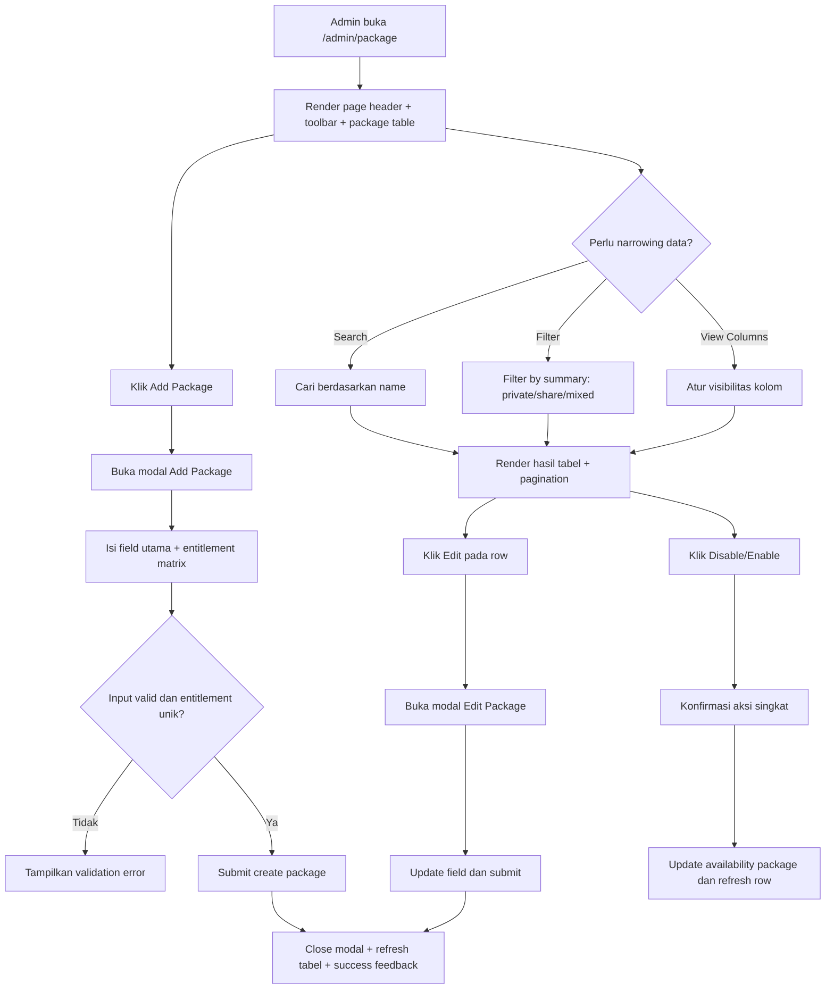

# Package Admin Flow
## Tujuan
Dokumen ini merangkum user-flow dan kontrak UI/UX untuk halaman `/admin/package` pada Phase `P3`. Dokumen ini mengikuti `.docs/PRD.md`, terutama bagian `3.5`, `3.10`, `7.1`, `7.6`, dan `10`, serta backlog dan acceptance criteria Phase `P3` di `.docs/E2E-FIRST-PHASE-PLAN.md`.

Dokumen ini mengunci `/admin/package` sebagai halaman kerja admin untuk mengelola package end-to-end tanpa bentrok dengan aturan bisnis v1. Fokus utamanya adalah membuat admin dapat mencari, memfilter, membuat, mengedit, dan `disable/enable` package dengan UI yang elegan, jelas, dan aman untuk operasi harian.

## Scope
- halaman `/admin/package`
- daftar package dengan toolbar tabel admin
- flow search, filter, `view columns`, dan pagination
- modal `Add New / Edit Package`
- flow `disable/enable` package
- entitlement matrix exact `accessKey`
- state loading, empty, validation, success, dan error yang relevan
- layout desktop, tablet, mobile, light mode, dan dark mode

## Prinsip Wajib
- `/admin/package` hanya bisa diakses oleh role `admin` melalui admin shell yang valid
- semua data package dibaca dan dimutasi server-side melalui session admin biasa
- tabel wajib memiliki `search`, `filter`, `view columns`, dan `pagination`
- search package hanya berdasarkan `name`
- filter package hanya berdasarkan ringkasan package `private`, `share`, `mixed`
- ringkasan package adalah data turunan sistem, bukan input manual dan bukan dasar otorisasi asset
- otorisasi package tetap ditentukan oleh entitlement exact `platform + asset_type` atau `accessKey`
- form minimum wajib memuat `name`, `price (Rp)`, `duration (hari)`, `checkout URL`, `is_extended`, dan entitlement matrix `accessKey`
- duplicate entitlement pada package yang sama wajib ditolak
- `total used` harus dihitung dari subscription berjalan berstatus `active` atau `processed`
- mekanisme “menghapus package dari dashboard” pada v1 hanya melalui `Disable/Enable`, bukan hard delete row package
- package yang di-disable tidak boleh dipakai untuk pembelian baru, assign manual baru, atau penerbitan CD-Key baru
- subscription aktif lama dan CD-Key lama yang sudah diterbitkan tetap aman

## Inventaris Screen dan State
- `/admin/package` state loading awal
- `/admin/package` state list sukses dengan data
- `/admin/package` state list kosong default
- `/admin/package` state list kosong hasil search atau filter
- modal `Add Package` closed
- modal `Add Package` open
- modal `Edit Package` open
- form state idle
- form state validation error
- form state submit loading
- form state success feedback melalui page-level inline banner di atas surface tabel
- entitlement duplicate prevented
- disable confirmation state
- enable confirmation state
- route-level server error state

## Peta Flow Ringkas


## 1. Tujuan UX Halaman `/admin/package`
Halaman ini harus menjawab tiga kebutuhan kerja admin dengan cepat:
- package apa saja yang tersedia saat ini
- bagaimana saya menemukan package tertentu atau subset package tertentu
- bagaimana saya membuat, memperbaiki, atau menonaktifkan package tanpa melanggar rule bisnis v1

Halaman ini bukan tempat untuk menjelaskan seluruh mesin subscription. Halaman ini adalah workspace operasional yang membantu admin mengelola katalog package dengan aman dan efisien.

## 2. Struktur Halaman dan Hierarchy
`/admin/package` harus mengikuti shell admin, tetapi tetap punya identitas halaman yang jelas.

### Hierarchy utama
1. page header dengan title, subtitle, dan CTA utama `Add Package`
2. toolbar tabel untuk `search`, `filter`, dan `view columns`
3. tabel package sebagai pusat area kerja
4. pagination di bawah tabel
5. modal add/edit sebagai area mutasi utama

### Layout desktop
- page header tampil lega dengan title yang jelas dan CTA utama di sisi yang mudah dijangkau mata
- toolbar tabel berada tepat di atas tabel agar hubungan kontrol dan data terasa dekat
- tabel menjadi surface utama dengan spacing cukup agar data mudah dipindai

### Layout tablet
- header boleh wrap menjadi dua baris ringan
- toolbar dapat terpecah menjadi dua baris selama urutan prioritas tetap jelas
- tabel tetap tampil sebagai tabel dengan horizontal scroll terkontrol jika dibutuhkan

### Layout mobile
- title, subtitle, dan CTA dipadatkan dengan hierarchy yang tetap jelas
- search tetap menjadi kontrol paling cepat ditemukan
- filter dan `view columns` boleh dipindahkan ke popover atau sheet ringan bila ruang tidak cukup
- tabel tidak boleh dipaksa menjadi grid padat yang sulit dibaca; horizontal scroll terkontrol lebih aman jika kolom minimum tetap harus dipertahankan

## 2A. Wireframe Teks Halaman `/admin/package`
Bagian ini menerjemahkan hierarchy halaman ke bentuk wireframe teks agar layout utama, toolbar, tabel, dan modal lebih konkret sebelum implementasi UI.

### Desktop page
```text
+--------------------------------------------------------------------------------------------------+
| Page Title: Package Management                                       [ Add Package ]             |
| Subtitle: Create and manage subscription packages with exact entitlement rules.                  |
+--------------------------------------------------------------------------------------------------+
| Search package name....................... | Summary Filter | View Columns | Secondary Control    |
+--------------------------------------------------------------------------------------------------+
| Name        | Amount (Rp) | Duration | Checkout URL | Total Used | Created At | Updated At | Act |
|-------------|-------------|----------|--------------|------------|------------|------------|-----|
| Starter A   | 150.000     | 30 days  | /checkout/a  | 42         | ...        | ...        | ... |
| Pro Mix     | 300.000     | 30 days  | /checkout/b  | 17         | ...        | ...        | ... |
| Swing Pack  | 500.000     | 90 days  | /checkout/c  | 8          | ...        | ...        | ... |
+--------------------------------------------------------------------------------------------------+
| Pagination: < Prev   1  2  3   Next >                                                           |
+--------------------------------------------------------------------------------------------------+
```

### Tablet page
```text
+-------------------------------------------------------------------------------------------+
| Package Management                                                  [ Add Package ]       |
| Create and manage subscription packages...                                              |
+-------------------------------------------------------------------------------------------+
| Search package name.................................................                       |
| Summary Filter | View Columns | Secondary Control                                      |
+-------------------------------------------------------------------------------------------+
| Table with horizontal scroll if needed                                                   |
+-------------------------------------------------------------------------------------------+
| Pagination                                                                                |
+-------------------------------------------------------------------------------------------+
```

### Mobile page
```text
+--------------------------------------------------------------+
| Package Management                           [ Add Package ] |
| Create and manage subscription packages...                   |
+--------------------------------------------------------------+
| Search package name........................................  |
+--------------------------------------------------------------+
| [ Summary Filter ]   [ View Columns ]                        |
+--------------------------------------------------------------+
| Table viewport                                                |
| -> horizontal scroll terkontrol untuk kolom minimum          |
+--------------------------------------------------------------+
| Pagination                                                    |
+--------------------------------------------------------------+
```

## 3. Header Halaman dan Action Utama
Header halaman harus memberi orientasi dan rasa kontrol yang kuat.

### Elemen minimum header
- title: `Package Management` atau padanan yang setara
- deskripsi singkat yang menjelaskan fungsi halaman secara operasional
- primary CTA: `Add Package`

### Prinsip UX
- CTA `Add Package` harus menjadi aksi paling dominan di halaman ini
- title dan subtitle harus membantu admin memahami halaman tanpa membaca tabel lebih dulu
- visual header harus terasa premium dan rapi, tetapi tidak mengambil perhatian berlebihan dari tabel

## 4. Toolbar Tabel
Toolbar tabel mengontrol cara admin menemukan dan membaca data package.

### Search
- hanya mencari berdasarkan `name`
- search field harus cukup dominan dan mudah dijangkau
- placeholder sebaiknya langsung menjelaskan cakupan search, misalnya `Search package name`

### Filter
- filter hanya berdasarkan ringkasan package `private`, `share`, `mixed`
- filter tidak boleh memberi kesan bahwa ringkasan package adalah dasar otorisasi asset
- label filter harus ringan dan mudah dipindai

### View Columns
- dipakai untuk show/hide kolom non-kritis sesuai kebutuhan admin
- kolom minimum yang diwajibkan PRD tetap menjadi baseline yang harus tersedia pada state default
- personalisasi kolom tidak boleh membuat admin kehilangan pemahaman dasar halaman

### Pagination
- wajib selalu tersedia saat dataset melebihi satu halaman
- posisi pagination harus konsisten di bawah tabel
- di mobile, pagination tetap harus mudah disentuh dan tidak terlalu rapat

## 5. Tabel Package
Tabel adalah pusat keputusan halaman ini. Karena itu, readability dan scanability lebih penting daripada ornamen visual.

### Kolom minimum
- `name`
- `amount (Rp)`
- `duration (days)`
- `checkout URL`
- `total used`
- `created at`
- `updated at`

### Action row
- `Edit`
- `Disable/Enable`

### Rekomendasi hierarchy kolom
- `name` menjadi anchor utama setiap row
- `amount (Rp)` dan `duration (days)` harus mudah dibandingkan antar row
- `checkout URL` tampil utilitarian; jika panjang, boleh dipotong secara elegan dengan affordance untuk melihat versi penuh
- `total used` perlu cukup menonjol karena penting secara operasional
- `created at` dan `updated at` menjadi informasi sekunder

### Disabled state di tabel
- package yang disabled harus tetap terlihat di tabel
- visual state disabled harus jelas, misalnya lewat badge, row tone, atau status affordance yang konsisten
- disabled state tidak boleh membuat row terasa seperti history yang tidak bisa disentuh sama sekali

## 6. Flow Search, Filter, View Columns, dan Pagination
Flow ini memastikan halaman tetap usable saat data bertambah.

| Langkah | Apa yang dilihat admin             | Apa yang dilakukan admin                  | Respons sistem / state berikutnya                                |
| ------- | ---------------------------------- | ----------------------------------------- | ---------------------------------------------------------------- |
| 1       | Header, toolbar, dan tabel package | Menunggu data dimuat                      | UI menampilkan loading state yang stabil                         |
| 2       | Search field                       | Ketik nama package                        | Tabel memperbarui hasil sesuai nama package                      |
| 3       | Filter summary                     | Pilih `private`, `share`, atau `mixed`    | Tabel menampilkan subset yang relevan                            |
| 4       | View columns                       | Tampilkan atau sembunyikan kolom tertentu | Tabel menyesuaikan visibilitas kolom                             |
| 5       | Pagination                         | Pindah halaman data                       | Tabel memuat halaman berikutnya tanpa kehilangan context toolbar |

### Empty state hasil narrowing
- jika hasil search atau filter kosong, UI harus menjelaskan bahwa tidak ada package yang cocok dengan kriteria saat ini
- empty state hasil narrowing tidak boleh terlihat seperti error backend

## 7. Flow Add Package
Flow create package harus terasa fokus, cepat, dan aman untuk rule bisnis.

| Langkah | Apa yang dilihat admin | Apa yang dilakukan admin                | Respons sistem / state berikutnya                                                    |
| ------- | ---------------------- | --------------------------------------- | ------------------------------------------------------------------------------------ |
| 1       | CTA `Add Package`      | Klik tombol                             | Modal `Add Package` terbuka                                                          |
| 2       | Form package           | Isi field utama package                 | UI memvalidasi field dasar                                                           |
| 3       | Entitlement matrix     | Pilih satu atau lebih `accessKey` exact | UI menyusun paket entitlement                                                        |
| 4       | Validation             | Coba submit                             | Duplicate entitlement ditolak dan field error ditampilkan bila ada input tidak valid |
| 5       | Submit sukses          | Tunggu proses simpan                    | Modal tertutup, tabel refresh, success feedback tampil                               |

### Tujuan UX add flow
- admin memahami bahwa package disusun dari entitlement exact, bukan ringkasan manual
- admin tidak perlu menebak summary package karena sistem yang menurunkannya
- duplicate entitlement dicegah sedini mungkin

## 8. Flow Edit Package
Edit package harus terasa serupa dengan create flow agar admin tidak perlu mempelajari pola baru.

| Langkah | Apa yang dilihat admin | Apa yang dilakukan admin           | Respons sistem / state berikutnya                                 |
| ------- | ---------------------- | ---------------------------------- | ----------------------------------------------------------------- |
| 1       | Tabel package          | Klik `Edit` pada salah satu row    | Modal `Edit Package` terbuka dengan data terisi                   |
| 2       | Form edit              | Ubah field atau entitlement matrix | UI menjaga validasi seperti create flow                           |
| 3       | Submit                 | Simpan perubahan                   | Modal tertutup, row dan tabel diperbarui, success feedback tampil |

### Prinsip UX edit flow
- struktur modal edit harus sama dengan modal add agar beban belajar rendah
- admin harus bisa memahami apakah package sedang enabled atau disabled saat membuka edit flow
- perubahan pada entitlement matrix harus tetap tunduk pada rule exact entitlement dan duplicate prevention

## 9. Kontrak Modal `Add New / Edit Package`
Modal adalah tempat mutasi utama. Karena itu, layout modal harus sangat terstruktur.

### Section 1: Package identity
- `name`
- `price (Rp)`
- `duration (hari)`
- `checkout URL`

### Section 2: Package behavior
- `is_extended`

### Section 3: Entitlement matrix
- pilihan exact `accessKey` per tuple `platform + asset_type`

### Rekomendasi hierarchy modal
- field identity di bagian atas
- `is_extended` sebagai setting perilaku package di tengah atau dekat field durasi
- entitlement matrix sebagai section yang paling jelas secara visual karena ini adalah inti rule package
- footer modal berisi CTA primer simpan dan CTA sekunder batal atau close

### Prinsip UX modal
- modal harus fokus ke satu tugas: menyimpan package dengan konfigurasi yang benar
- validasi field harus muncul dekat field terkait, bukan hanya sebagai error global
- submit loading harus mencegah double submit
- modal harus nyaman dipakai di desktop dan tetap usable di mobile dengan scroll internal yang aman

### Wireframe teks modal desktop
```text
+----------------------------------------------------------------------------------+
| Add Package                                                           [ Close ]  |
| Configure a package with exact entitlement rules.                                |
+----------------------------------------------------------------------------------+
| Section: Package Identity                                                      |
| Name.................................................................          |
| Price (Rp)....................  Duration (hari).....................           |
| Checkout URL.........................................................           |
+----------------------------------------------------------------------------------+
| Section: Package Behavior                                                      |
| [ ] is_extended                                                                |
+----------------------------------------------------------------------------------+
| Section: Entitlement Matrix                                                    |
| Platform        Private        Share                                            |
| TradingView     [ ]            [ ]                                              |
| FxReplay        [ ]            [ ]                                              |
| FxTester        [ ]            [ ]                                              |
| Derived Summary: mixed                                                          |
+----------------------------------------------------------------------------------+
| [ Cancel ]                                                     [ Save Package ] |
+----------------------------------------------------------------------------------+
```

### Wireframe teks modal mobile
```text
+--------------------------------------------------------------+
| Add Package                                      [ Close ]   |
+--------------------------------------------------------------+
| Name........................................................ |
| Price (Rp).................................................. |
| Duration (hari)............................................. |
| Checkout URL................................................ |
| [ ] is_extended                                              |
+--------------------------------------------------------------+
| Entitlement Matrix                                           |
| TradingView   [Private] [Share]                              |
| FxReplay      [Private] [Share]                              |
| FxTester      [Private] [Share]                              |
| Derived Summary: mixed                                       |
+--------------------------------------------------------------+
| [ Cancel ]                               [ Save Package ]    |
+--------------------------------------------------------------+
```

## 10. Entitlement Matrix dan Package Summary
Entitlement matrix adalah pusat aturan bisnis halaman ini.

### Prinsip domain yang wajib dipantulkan ke UI
- satu entitlement merepresentasikan tuple exact `platform + asset_type`
- kesamaan `asset_type` saja tidak cukup
- kesamaan `platform` saja tidak cukup
- duplicate entitlement tidak diperbolehkan
- summary `private/share/mixed` dihitung sistem dari daftar entitlement yang dipilih

### Kontrak UX entitlement matrix
- admin memilih entitlement exact melalui format yang mudah dipahami, misalnya checklist atau grouped matrix per platform dan asset type
- jika admin mencoba memilih entitlement duplikat, UI harus langsung menolak; pada implementasi matrix checkbox 3 x 2, duplicate dicegah oleh bentuk kontrol UI dan tetap divalidasi lagi di schema/domain sebagai guard kedua
- UI boleh menampilkan preview summary package, tetapi preview itu tidak boleh bisa diedit manual

### Copy UX yang disarankan
- helper copy: `Package summary is derived automatically from selected entitlements.`
- validation copy: `Duplicate entitlement is not allowed.`

## 11. Flow Disable / Enable Package
Karena v1 tidak mengenal hard delete package dari dashboard, flow disable/enable harus jelas, ringan, dan tidak menyesatkan.

| Langkah | Apa yang dilihat admin | Apa yang dilakukan admin     | Respons sistem / state berikutnya          |
| ------- | ---------------------- | ---------------------------- | ------------------------------------------ |
| 1       | Row package pada tabel | Klik `Disable` atau `Enable` | UI membuka confirmation flow ringan        |
| 2       | Confirmation message   | Konfirmasi aksi              | Sistem memperbarui availability package    |
| 3       | Tabel setelah update   | Membaca status terbaru       | Row diperbarui dan success feedback tampil |

### Prinsip UX disable/enable
- aksi ini bukan hard delete, jadi confirmation tidak perlu terasa terlalu destruktif
- message konfirmasi harus menjelaskan dampak bisnis utama secara singkat
- disabled package tetap tampil di tabel untuk kebutuhan audit operasional dan edit lanjutan

### Dampak bisnis yang harus tercermin di UI
- package disabled memblokir pembelian baru
- package disabled memblokir assign manual baru
- package disabled memblokir penerbitan CD-Key baru
- subscription aktif lama tetap aman
- CD-Key lama yang sudah diterbitkan tetap aman

## 12. State UI yang Wajib Ada
### Loading state
- loading awal halaman harus menjaga struktur header, toolbar, dan tabel tetap stabil
- loading submit modal harus jelas pada tombol simpan

### Empty state default
- jika belum ada package sama sekali, halaman harus tetap terasa intentional dan memberi CTA jelas untuk membuat package pertama

### Empty state hasil search/filter
- tampilkan pesan yang menjelaskan bahwa tidak ada package yang cocok dengan kriteria saat ini

### Validation error
- field-level error untuk `name`, `price`, `duration`, `checkout URL`, dan entitlement matrix jika relevan
- duplicate entitlement error harus sangat jelas
- pada matrix checkbox, duplicate biasanya tidak muncul dari interaction normal, tetapi validation guard tetap wajib ada untuk payload yang dimanipulasi atau mapping form yang salah

### Success feedback
- create, edit, disable, dan enable perlu punya feedback sukses yang konsisten melalui page-level inline banner di atas surface tabel

### Server error
- route-level error harus dibedakan dari validation error
- modal submit error generik harus memberi admin peluang retry tanpa kehilangan konteks form jika memungkinkan

### Wireframe teks state penting
```text
Loading page:
[ Header placeholder ]
[ Toolbar placeholder ]
[ Table skeleton rows ]

Empty filtered:
[ No packages match the current search or filter ]
[ Clear filter ]

Validation error in modal:
Name..............................................
Error: Name is required.

Entitlement Matrix
[ TradingView / Private sudah terpilih ]
[ TradingView / Private tidak bisa dipilih dua kali dari matrix yang sama ]
Guard validation: Duplicate entitlement is not allowed.
```

## 13. Visual Direction Halaman Package
Halaman package harus menjadi wajah pertama admin dashboard yang terasa elegan, cantik, dan profesional.

### Arah visual yang dikunci
- premium SaaS admin dengan hierarchy bersih dan spacing terukur
- polished table surfaces dengan border atau shadow halus
- CTA, badge, focus ring, dan state disabled yang konsisten di light mode dan dark mode
- micro-interactions singkat pada button, row hover, popover, dan modal open/close

### Anti-pattern yang harus dihindari
- header terlalu ramai dengan card dekoratif yang tidak membantu workflow
- modal yang terlalu padat sehingga entitlement matrix terasa seperti afterthought
- mobile layout yang mengorbankan search atau CTA utama demi mempertahankan semua kontrol dalam satu baris
- dark mode yang terlalu pekat dan menurunkan keterbacaan tabel

## 14. Responsive Behavior
### Desktop
- header terasa lega
- toolbar dekat dengan tabel
- tabel menjadi pusat kerja utama

### Tablet
- toolbar boleh wrap
- modal tetap terasa nyaman dengan section yang jelas
- tabel tetap dipertahankan sebagai tabel bila masih masuk akal

### Mobile
- CTA `Add Package` tetap mudah dijangkau
- search tetap muncul jelas
- filter dan `view columns` boleh masuk ke popover atau sheet ringan
- tabel boleh memakai horizontal scroll terkontrol untuk menjaga kolom minimum tetap utuh

## 15. Light Mode dan Dark Mode
### Light mode
- harus terasa bersih, modern, dan trusted
- row hover, disabled state, dan badge tetap terbaca jelas

### Dark mode
- harus tetap elegan dan calm, bukan tampil seperti terminal dekoratif
- perbedaan antar layer tabel, modal, toolbar, dan page background harus tetap jelas

## 16. Copy UX yang Disarankan
- page subtitle: `Create and manage subscription packages with exact entitlement rules.`
- empty default: `No packages yet.`
- empty filtered: `No packages match the current search or filter.`
- success create/edit: `Package saved.`
- success disable: `Package disabled.`
- success enable: `Package enabled.`
- helper disable rule: `Disabled packages stay valid for existing subscriptions and previously issued CD-Keys.`

## 16A. Mekanisme Success Feedback yang Dikunci
- success feedback untuk create, edit, disable, dan enable memakai page-level inline banner yang muncul di atas surface tabel
- banner success harus tetap terlihat setelah modal atau confirmation ditutup
- banner success tidak boleh bergantung pada alert browser native
- message success harus singkat, konsisten, dan mudah diuji pada browser verification

## 17. Matriks State Halaman Package
| Kondisi                    | Header                           | Toolbar                     | Table                       | Modal                     |
| -------------------------- | -------------------------------- | --------------------------- | --------------------------- | ------------------------- |
| Loading awal               | tampil placeholder               | tampil placeholder          | skeleton row                | tertutup                  |
| Data tersedia              | tampil normal                    | aktif                       | tampil row package          | tertutup                  |
| Data kosong default        | tampil normal                    | aktif                       | empty state + CTA           | tertutup                  |
| Hasil search/filter kosong | tampil normal                    | aktif dengan criteria aktif | empty state hasil narrowing | tertutup                  |
| Add/Edit modal open        | tetap terlihat di belakang modal | tetap menjadi context       | tetap ada di belakang modal | form aktif                |
| Validation error           | tetap normal                     | tetap normal                | tetap normal                | field error terlihat      |
| Submit loading             | tetap normal                     | tetap normal                | tetap normal                | submit disabled + loading |
| Route error                | title tetap ada                  | boleh disederhanakan        | route error state           | tertutup                  |

## 18. Batasan yang Harus Dijaga Saat Implementasi
- jangan tambahkan hard delete package ke dashboard v1
- jangan jadikan ringkasan package sebagai dasar otorisasi asset
- jangan biarkan duplicate entitlement lolos dari UI tanpa penanganan jelas
- jangan sembunyikan package disabled sepenuhnya dari tabel karena admin masih perlu konteks operasionalnya
- jangan membuat toolbar tabel berbeda drastis dari kontrak global admin shell
- jangan mengorbankan responsive usability hanya demi mempertahankan semua kolom terlihat penuh di mobile
